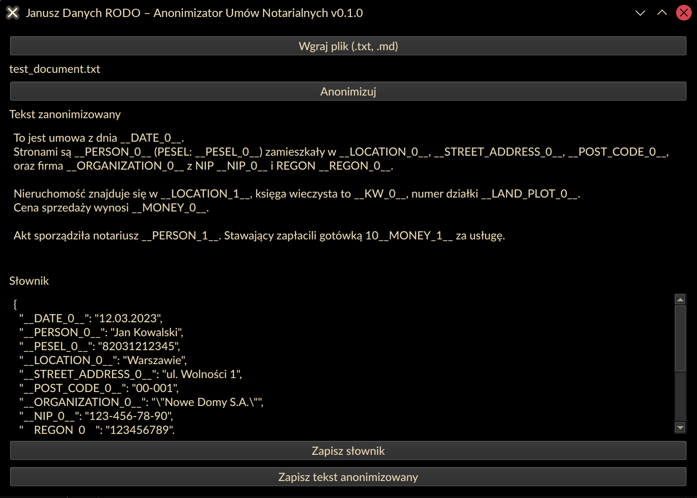

# Janusz Danych Rodo

Proste narzędzie do anonimizacji dokumentów, stworzone z myślą o ochronie danych wrażliwych w polskich umowach i pismach urzędowych.

Aplikacja zamienia zidentyfikowane dane wrażliwe (jak nazwiska, numery PESEL, adresy) na unikalne znaczniki (np. `__PERSON_0__`, `__PESEL_0__`). Dodatkowo generowany jest plik z mapą tokenów, który pozwala na odwrócenie tego procesu.

**Uwaga:** Aby zachować zgodność z RODO, plik z mapą tokenów nie powinien być udostępniany razem z zanonimizowanym dokumentem, gdyż umożliwia on odtworzenie oryginalnych danych.

[Pełna specyfikacja projektu (BRD)](resources/readme-BRD.md)

## Instalacja

Aplikacja wymaga środowiska wirtualnego Python.

1.  **Utwórz i aktywuj środowisko wirtualne:**
    ```bash
    # Linux/macOS
    python3 -m venv venv
    source venv/bin/activate

    # Windows
    python -m venv venv
    .\\venv\\Scripts\\activate
    ```

2.  **Zainstaluj zależności:**
    ```bash
    pip install -r requirements.txt
    ```

## Dostępne interfejsy

Projekt oferuje trzy sposoby interakcji:

### 1. Interfejs Linii Komend (CLI)

Idealny do automatyzacji i przetwarzania wsadowego.

**Uruchomienie:**
```bash
python3 janusz-cli.py [OPCJE]
```

**Dostępne opcj:**
```
-h, --help            pokaż pomoc i wyjdź
-i INPUT, --input INPUT
                      ścieżka do pliku źródłowego
-o OUTPUT, --output OUTPUT
                      ścieżka do pliku wyjściowego. Domyślnie <input>.anon.<ext>
```

**Przykład:**
```bash
python3 janusz-cli.py -i ./umowa.txt
```
Spowoduje to utworzenie pliku `umowa.anon.txt` ze zanonimizowaną treścią oraz `umowa.anon.map.json` z mapą tokenów.


### 2. Aplikacja Desktopowa (PySide6)

Graficzny interfejs użytkownika do pracy na pojedynczych plikach.



**Uruchomienie:**
```bash
python3 janusz-pyside.py
```

### 3. Interfejs Webowy (Gradio)

Umożliwia pracę przez przeglądarkę internetową, idealny do demonstracji

**Uruchomienie:**
```bash
python3 janusz-gradio.py
```
Aplikacja będzie dostępna pod adresem: `http://127.0.0.1:7860`